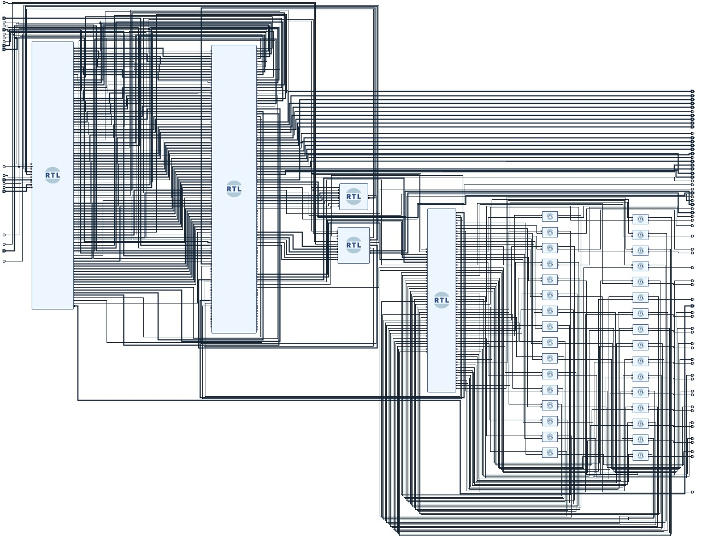

# RVfpgaSoC Curse

## Introduction
Through this document we want to present a development of a part of the RVfpgaSoC course which was carried out in order to begin to internalize and manage the construction of a SweRVolfX SoC subset from scratch using basic components such as the core, the memories and the SweRV peripherals. As basic tools, Vivado was used, Cygwin (Since it was done on Windows, this being expendable if working on Linux), Visual Studio Code (PlatformIO), among others.

## Laboratory 1
The first part consisted of a brief introduction to SoC, SweRVolfX, RVfpga and RVfpgaSoC to understand how to start the construction of the Block Design, which was composed of: 
* [Swerv Wrapper module](img/ModulesPDF/1_Module_swerv_wrapper_verilog.pdf)
* [Interconnect Wrapper module](img/ModulesPDF/2_Module_IntconWrapper.pdf)
* [Boot-ROM module](img/ModulesPDF/3_Module_BootromWrapper.pdf)
* [GPIO Top module](img/ModulesPDF/4_Module_SysconWrapper.pdf)
* [System Controller module](img/ModulesPDF/)
* 32 [Bidirectional GPIO modules](img/ModulesPDF/)
To finally have a block design, with a top view, like this: 
<p align="center">
  
</p>

## Second Part
In this part we began to develop the implementation and use of the modules created in the previous part, thus creating a main module in which our design with the clock and memories would be connected. To carry out these objectives, the Verilator tool was used with which, later, using PlatformIO, the process of creating the trace could be continued.

### Errors presented
Below we will show the different errors that occurred when making this second part:

- when the binary simulator had to be generated using the following commands
```
➢	cd [RVfpgaSoCPath]/RVfpgaSoC/Labs/LabResources/Lab2/verilatorSIM
➢	make clean
➢	make
```
The following error appeared, which will be shown below in the following image:

<p align="center">
	
</p>

We realized that it was due to the lack of libraries in the verilated.cpp file, so we proceeded to find the path where this file was located to modify it, as shown in the following image:

<p align="center">
	
</p>

After adding the libraries shown in the image above, which are:
```
limits
cstddef
iostream
```
the previous commands were executed again, being successful this time.

-When we tried to generate the trace.vcd file via VSCode and PlatformIO, we got the following simulation output:


when the file was searched in the path where it was generated, we realized that it was not there, so we proceeded to see if it was in a hidden file, but this was not the case

#### Presented by:
<p align="left">
  
</p>
Camilo E. Carrillo <br />
Electronic Engineering bachelor student at Universidad Industrial de Santander - Colombia

<p align="left">
  
</p>
Erika D. Porras <br />
Electronic Engineering bachelor student at Universidad Industrial de Santander - Colombia <br />

#### Special Thanks
<p align="center">
  
  
</p>
